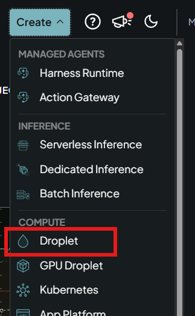
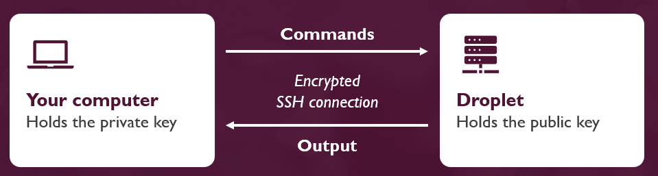
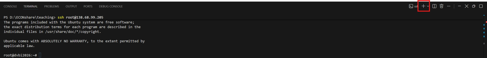
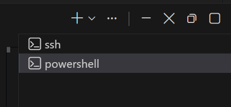
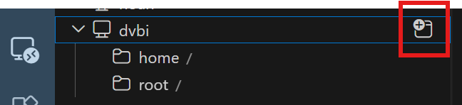

# SSH setup guide

This guide helps you to create a Droplet on Digital Ocean, and create an SSH connection from Positron to the Droplet.

**Before you start**

- Terminal commands are to be run from the terminal in Positron.

## Table of Contents

1. [Create a droplet on DigitalOcean](#1-create-a-droplet-on-digitalocean)
2. [Finish setup of the droplet](#2-finish-setup-of-the-droplet)
3. [What is SSH?](#3-what-is-ssh)
4. [Create an SSH key pair](#4-create-an-ssh-key-pair)
5. [Log in to the droplet using the password](#5-log-in-to-the-droplet-using-the-password)
6. [Copy the public SSH key to the droplet](#6-copy-the-public-ssh-key-to-the-droplet)
7. [Set up the SSH config file](#7-set-up-the-ssh-config-file)
8. [Connect to the droplet from Positron](#8-connect-to-the-droplet-from-positron)
9. [Troubleshooting](#9-troubleshooting)

## 1. Create a droplet on DigitalOcean

1. Create a user on [digitalocean.com](https://www.digitalocean.com/).
2. Click "Create" at the top of the page and choose "Droplet" (marked in red below).

   

3. Choose the following settings:
   - **Region:** Frankfurt
   - **Version:** Ubuntu 22.04 (LTS) x64
   - **Droplet type:** Basic
   - **CPU options:** Regular, $12/mo (2 GB / 1 CPU, 25 GB SSD disk). You can scale up later if needed.
   - **Authentication:** Password (create a strong password). We will add the SSH key later.

## 2. Finish setup of the droplet

1. **Hostname:** Give your droplet a name in the field "Give your droplet a name".
2. Create the droplet.
3. After the droplet has initialized, you can access it.

Good to know:

- Choose "Insights" to see the resources used by the droplet. The bottleneck will most likely be the memory (RAM).
- If you need more resources: "Settings" → "Resize". Larger droplets cost extra, and you **cannot decrease** the droplet size again.
- Click the "Web console" button to access the command line of your Linux virtual machine (VM) directly in the browser (but we will instead connect with SSH using Positron).
- To destroy (delete) the droplet: "Settings" → scroll to the bottom to find the "Destroy" button.

## 3. What is SSH?

SSH (Secure Shell) is a safe way to run shell commands on another machine, e.g. a DigitalOcean droplet. The commands you type on your computer are sent to the droplet, where they run, and the output is sent back to your computer. Everything in both directions travels through one encrypted connection.



SSH keys come in pairs:

| Key | Where it lives | Share it? |
|---|---|---|
| **Public key** (`id_ed25519_dvbi.pub`) | Placed on the droplet | Yes, it is safe to share |
| **Private key** (`id_ed25519_dvbi`) | Stays on your computer | **Never share it** |

When you connect, your private key proves who you are to the droplet, which checks it against the public key it holds. The private key itself never leaves your computer.

## 4. Create an SSH key pair

If you do not have a `.ssh` folder in your home folder, create it first (you can use the commands below in your Positron terminal).

Windows (PowerShell):

```powershell
New-Item -ItemType Directory -Force "$HOME\.ssh"
```

macOS:

```bash
mkdir -p ~/.ssh
```

Create the key pair (Windows and macOS):

```bash
ssh-keygen -t ed25519 -f "$HOME/.ssh/id_ed25519_dvbi"
```

Press Enter twice to skip the passphrase (not needed in this course).

The key pair is now in your `.ssh` folder:

| | Windows | macOS |
|---|---|---|
| Folder | `C:\Users\<username>\.ssh\` | `/Users/<username>/.ssh/` (also written `~/.ssh/`) |
| Private key | `id_ed25519_dvbi` | `id_ed25519_dvbi` |
| Public key | `id_ed25519_dvbi.pub` | `id_ed25519_dvbi.pub` |

## 5. Log in to the droplet using the password

You find the IP address of your droplet on the "Droplets" page on DigitalOcean (marked in red below).


Replace `<DROPLET_IP>` with the IP address of your droplet, **including the `<` and `>`**, here and in the rest of this guide. Example: `ssh root@<DROPLET_IP>` becomes `ssh root@64.226.114.147`. Run:

```bash
ssh root@<DROPLET_IP>
```

- If you are asked whether to trust the server, answer `yes`.
- Type the password of your droplet. **The password is hidden while you type**, so you will not see any characters. Just type it and press Enter.

You are now logged in: the terminal shows the prompt `root@<DROPLET_NAME>:~#` (e.g. `root@dvbi2026:~#`), and the commands you type now run on the droplet, not on your local computer.

## 6. Copy the public SSH key to the droplet

Open a **new local terminal** by clicking the small "+" in the terminal panel in Positron (marked in red below). The next command copies your public key from your laptop to the droplet, so it must run on your laptop, not in the droplet terminal from step 5.



You now have two terminals open in Positron. They are listed on the right side of the terminal panel (see below), and you switch between them by clicking them. The "ssh" terminal runs commands on your droplet, and the "powershell" terminal (called "zsh" on macOS) runs commands on your laptop.



In the local terminal, run this command to copy your public key to the droplet:

```bash
cat "$HOME/.ssh/id_ed25519_dvbi.pub" | ssh root@<DROPLET_IP> "mkdir -p ~/.ssh && chmod 700 ~/.ssh && cat >> ~/.ssh/authorized_keys && chmod 600 ~/.ssh/authorized_keys"
```

Enter the droplet password when asked.

> [!NOTE]
> **What the command does.** It reads your public key on your laptop, sends it to the droplet, and adds it to the file `~/.ssh/authorized_keys`. This is the file where the SSH server on the droplet looks for the public keys that are allowed to log in.
>
> <details>
> <summary>Click if you want to see the command explained step by step</summary>
>
> | Part | What it does |
> |---|---|
> | `$HOME` | Your home folder on your laptop, e.g. `C:\Users\<username>` on Windows or `/Users/<username>` on macOS |
> | `cat "$HOME/.ssh/id_ed25519_dvbi.pub"` | Prints the content of your public key file |
> | `\|` | The pipe: sends the output of the command on the left as input to the command on the right |
> | `ssh root@<DROPLET_IP> "..."` | Logs in to the droplet and runs the commands in quotes there. Everything in the quotes runs on the droplet (Linux), also if your laptop runs Windows |
> | `&&` | Runs the next command only if the previous one succeeded |
> | `mkdir -p ~/.ssh` | Creates the `.ssh` folder in your home folder on the droplet (`~` is your home folder, which is `/root` when you log in as `root`). `-p` means: no error if the folder already exists |
> | `chmod 700 ~/.ssh` | Sets the permissions of the folder, so only you (the owner) can read, write and open it. The three digits are the permissions for the owner, the group and everyone else: 7 = all permissions, 0 = none |
> | `cat >> ~/.ssh/authorized_keys` | `cat` takes the key it receives from your laptop, and `>>` adds it to the end of `authorized_keys`. The file is created if it does not exist, and keys already in it are kept |
> | `chmod 600 ~/.ssh/authorized_keys` | Only you can read and write the file (6 = read and write) |
>
> The permissions matter: SSH refuses to use the keys if other users can change the folder or the file.
>
> </details>

## 7. Set up the SSH config file

Go to your `.ssh` folder on your laptop and check if you have a file called `config` (no file extension). If not, create it. Alternatively, you can create the file from the Positron terminal:

Windows (PowerShell):

```powershell
New-Item -ItemType File "$HOME\.ssh\config"
```

macOS:

```bash
touch ~/.ssh/config
```

Open the `config` file in Positron (File → Open File...) and add the following at the end of the file. Remember to replace `<DROPLET_IP>` with your droplet's IP address.

```text
Host dvbi
    HostName <DROPLET_IP>
    User root
    IdentityFile ~/.ssh/id_ed25519_dvbi
    IdentitiesOnly yes
```

This tells SSH which private key to use for this host (where the host in this case is your droplet), so you can connect with the short name `dvbi`.

Test the connection from the terminal. You should now be logged in **without** being asked for a password:

```bash
ssh dvbi
```

Type `exit` to leave the droplet again.

## 8. Connect to the droplet from Positron

1. Open the Command Palette in Positron: `Ctrl+Shift+P` (Windows) or `Cmd+Shift+P` (macOS).
2. Type `Remote-SSH: Connect to Host` and choose `dvbi`.
3. A new Positron window opens and connects to the droplet. The first time you connect, Positron installs a server program on the droplet, which can take a minute or two. Working in the new window is like working directly on the droplet: the files you open, the terminal, and the code you run are all on the droplet.
4. Click the Explorer icon (the top icon in the bar on the far left) in the new Positron window and click "Open Folder". Choose `/root/`, which is your home folder on the droplet, and click "OK".
5. If Positron asks "Do you trust the authors of the files in this folder?", click "Yes, I trust the authors". If you instead see a "Restricted Mode" banner at the top of the window, click "Manage" and then "Trust". In Restricted Mode, some features of Positron are turned off. It is safe to trust the folder, because it is on your own droplet.

You can also connect to the droplet from the Remote Explorer (in your old Positron window): click the Remote Explorer icon (a monitor) in the bar on the far left of Positron, and click the "Connect to Host in New Window" icon next to `dvbi` (marked in red below). The folders you have opened on the droplet before are listed under `dvbi`, so you can open them again directly.




