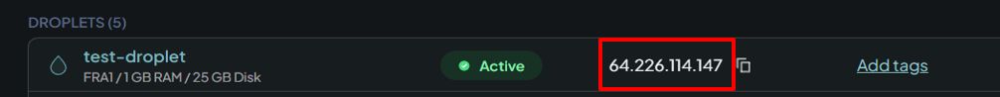

# SSH setup guide

This guide follows the slides "Creating droplet on Digital Ocean" to "Connect to the droplet from your laptop" in the slideset "1. Introduction". Use this page when you need to copy commands: the code blocks below can be copied directly (use the copy button in the top right corner of each block on GitHub).

**Before you start**

- Run the commands in the terminal in Positron. On Windows this is PowerShell, on macOS it is zsh. All commands in this guide work in both unless stated otherwise.
- Replace `<DROPLET_IP>` with the IP address of your droplet, **including the `<` and `>`**. You find the IP address on the "Droplets" page on DigitalOcean (marked in red below). Example: `ssh root@<DROPLET_IP>` becomes `ssh root@64.226.114.147`.



## Table of Contents

1. [Create a droplet on DigitalOcean](#1-create-a-droplet-on-digitalocean)
2. [Finish setup of the droplet](#2-finish-setup-of-the-droplet)
3. [What is SSH?](#3-what-is-ssh)
4. [Create an SSH key pair](#4-create-an-ssh-key-pair)
5. [Log in to the droplet using the password](#5-log-in-to-the-droplet-using-the-password)
6. [Copy the public SSH key to the droplet](#6-copy-the-public-ssh-key-to-the-droplet)
7. [Provide the public key to DigitalOcean](#7-provide-the-public-key-to-digitalocean)
8. [Set up the SSH config file](#8-set-up-the-ssh-config-file)
9. [Connect to the droplet from Positron](#9-connect-to-the-droplet-from-positron)
10. [Troubleshooting](#10-troubleshooting)

## 1. Create a droplet on DigitalOcean

1. Create a user on [digitalocean.com](https://www.digitalocean.com/).
2. Go to "Droplets" and click "Create Droplet".
3. Choose the following settings:
   - **Region:** Frankfurt
   - **Version:** Ubuntu 22.04 (LTS) x64
   - **Droplet type:** Basic
   - **CPU options:** Regular, $12/mo (2 GB / 1 CPU, 25 GB SSD disk). You can scale up later if needed.
   - **Authentication:** Password (create a strong password). We will add the SSH key later.

## 2. Finish setup of the droplet

1. **Hostname:** Give your droplet a name in the field "Give your droplet a name".
2. Create the droplet.
3. After the droplet has initialized, you can access it.

Good to know:

- Choose "Insights" to see the resources used by the droplet. The bottleneck will most likely be the memory (RAM).
- If you need more resources: "Settings" → "Resize". Larger droplets cost extra, and you **cannot decrease** the droplet size again.
- Click the "Web console" button to access the command line of your Linux virtual machine (VM) directly in the browser.
- To destroy (delete) the droplet: "Settings" → scroll to the bottom to find the "Destroy" button.

## 3. What is SSH?

SSH (Secure Shell) is a safe way to run shell commands on another machine, e.g. a DigitalOcean droplet. The commands you type on your computer are sent to the droplet, where they run, and the output is sent back to your computer. Everything in both directions travels through one encrypted connection.

We want to log in with SSH keys. SSH keys come in pairs:

| Key | Where it lives | Share it? |
|---|---|---|
| **Public key** (`id_ed25519_dvbi.pub`) | Placed on the droplet | Yes, it is safe to share |
| **Private key** (`id_ed25519_dvbi`) | Stays on your computer | **Never share it** |

When you connect, your private key proves who you are to the droplet, which checks it against the public key it holds. The private key itself never leaves your computer.

## 4. Create an SSH key pair

If you do not have a `.ssh` folder in your home folder, create it first.

Windows (PowerShell):

```powershell
New-Item -ItemType Directory -Force "$HOME\.ssh"
```

macOS:

```bash
mkdir -p ~/.ssh
```

Create the key pair (Windows and macOS):

```bash
ssh-keygen -t ed25519 -f "$HOME/.ssh/id_ed25519_dvbi"
```

Press Enter twice to skip the passphrase (not needed in this course).

The key pair is now in your `.ssh` folder:

| | Windows | macOS |
|---|---|---|
| Folder | `C:\Users\<username>\.ssh\` | `/Users/<username>/.ssh/` (also written `~/.ssh/`) |
| Private key | `id_ed25519_dvbi` | `id_ed25519_dvbi` |
| Public key | `id_ed25519_dvbi.pub` | `id_ed25519_dvbi.pub` |

## 5. Log in to the droplet using the password

Find the IP address of your droplet on DigitalOcean (see [the screenshot at the top](#ssh-setup-guide)), and run:

```bash
ssh root@<DROPLET_IP>
```

- If you are asked whether to trust the server, answer `yes`.
- Type the password of your droplet. **The password is hidden while you type**, so you will not see any characters. Just type it and press Enter.

## 6. Copy the public SSH key to the droplet

Open a **new local terminal** (click the small "+" in the terminal panel in Positron). This command must run on your laptop, not inside the droplet from step 5.

```bash
cat "$HOME/.ssh/id_ed25519_dvbi.pub" | ssh root@<DROPLET_IP> "mkdir -p ~/.ssh && chmod 700 ~/.ssh && cat >> ~/.ssh/authorized_keys && chmod 600 ~/.ssh/authorized_keys"
```

Enter the droplet password when asked.

This copies the public key from your laptop to the droplet and adds it as an authorized key. Step by step:

| Part | What it does |
|---|---|
| `cat "$HOME/.ssh/id_ed25519_dvbi.pub"` | Reads your public key on your laptop |
| `\| ssh root@<DROPLET_IP> "..."` | Sends it to the droplet and runs the command in quotes there |
| `mkdir -p ~/.ssh` | Creates the `.ssh` folder on the droplet if it does not exist |
| `chmod 700 ~/.ssh` | Only you can access the folder |
| `cat >> ~/.ssh/authorized_keys` | Appends your public key to the list of keys allowed to log in |
| `chmod 600 ~/.ssh/authorized_keys` | Only you can read and write the file |

## 7. Provide the public key to DigitalOcean

Show your public key in the terminal:

```bash
cat "$HOME/.ssh/id_ed25519_dvbi.pub"
```

Copy the whole line it prints (it starts with `ssh-ed25519`). You can also open the file `id_ed25519_dvbi.pub` in a text editor and copy the text from there.

On DigitalOcean, go to "Settings" → "Security" → "Add SSH Key":

1. Paste the key into the "SSH key content" textbox.
2. Give the SSH key a name, e.g. "For DVBI course".

This registers the public key with DigitalOcean, so it can also be used for other droplets you create.

## 8. Set up the SSH config file

Go to your `.ssh` folder on your laptop and check if you have a file called `config` (no file extension). If not, create it.

Windows (PowerShell):

```powershell
New-Item -ItemType File "$HOME\.ssh\config"
```

macOS:

```bash
touch ~/.ssh/config
```

Open the `config` file in Positron (File → Open File...) and add the following at the end of the file. Remember to replace `<DROPLET_IP>` with your droplet's IP address.

```text
Host dvbi
    HostName <DROPLET_IP>
    User root
    IdentityFile ~/.ssh/id_ed25519_dvbi
    IdentitiesOnly yes
```

This tells SSH which private key to use for this host (where the host in this case is your droplet), so you can connect with the short name `dvbi`.

Test the connection from the terminal. You should now be logged in **without** being asked for a password:

```bash
ssh dvbi
```

Type `exit` to leave the droplet again.

## 9. Connect to the droplet from Positron

1. Open the Command Palette in Positron: `Ctrl+Shift+P` (Windows) or `Cmd+Shift+P` (macOS).
2. Type `Remote-SSH: Connect to Host` and choose `dvbi`.

## 10. Troubleshooting

**The command fails after copying it from the slides.**
PowerPoint changes straight quotes `"` into curly quotes `“ ”`, which the terminal does not understand. Copy the commands from this page instead.

**`Permission denied (publickey)` when running `ssh dvbi`.**
Check that step 6 ran without errors, and that the `IdentityFile` line in your `config` file points to `~/.ssh/id_ed25519_dvbi` (the private key, without `.pub`).

**`ssh dvbi` says `Could not resolve hostname dvbi`.**
SSH cannot find your `config` file. On Windows, check that the file is called `config` and not `config.txt`: Notepad adds `.txt` automatically. In File Explorer, turn on "View" → "Show" → "File name extensions" to see the full file name.

**`WARNING: REMOTE HOST IDENTIFICATION HAS CHANGED!`**
This happens if you destroy a droplet and create a new one that gets the same IP address. Remove the old entry from your laptop and connect again:

```bash
ssh-keygen -R <DROPLET_IP>
```
