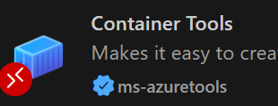

# Working with a small droplet

This guide helps you to make the most of the 2 GB of memory on your droplet. It shows how to add swap to the droplet, and how to keep only the Positron extensions you need for the course on the droplet. The extensions stay installed in Positron on your laptop, so you can still use them there.

**Before you start**

- You can connect to your droplet from Positron (see [Droplet and SSH setup guide.md](Droplet%20and%20SSH%20setup%20guide.md)).
- Terminal commands are to be run from the terminal in the Positron window that is connected to the droplet.

## Table of Contents

1. [Why memory matters on the droplet](#1-why-memory-matters-on-the-droplet)
2. [Add swap to the droplet](#2-add-swap-to-the-droplet)
3. [Extensions on your laptop and on your droplet](#3-extensions-on-your-laptop-and-on-your-droplet)
4. [Which extensions to keep on the droplet](#4-which-extensions-to-keep-on-the-droplet)
5. [Remove extensions from the droplet](#5-remove-extensions-from-the-droplet)
6. [Check the result](#6-check-the-result)

## 1. Why memory matters on the droplet

When you connect to your droplet from Positron, Positron runs a server program on the droplet, and the extensions run there too. Your droplet only has 2 GB of memory (RAM), and the Positron server uses a large part of it by itself: on a course droplet with only the three extensions from section 4, it used about 0.9 GB. Most of that is Positron itself and its built-in extensions, which you cannot remove. Your Docker containers have to share the rest.

When the memory runs out, the droplet becomes slow, or Linux stops a program to free memory, for example one of your containers. You can do two things about it:

- **Add swap** (section 2). This gives Linux room to move memory that is not in use out of the RAM, so it does not have to stop your programs.
- **Remove the Positron extensions you do not need from the droplet** (sections 3-6). The first time you connect, Positron installs a set of its standard extensions on the droplet, and we do not need them in this course. Removing them does not make a big difference, but it saves some memory, and some of them start extra programs that use more memory, for example when you open a Python file.

## 2. Add swap to the droplet

Swap is a file on the droplet's disk that Linux uses as extra memory when the RAM is full. Linux moves memory that programs have not used for a while from the RAM to the swap file, and moves it back when a program needs it again. The disk is much slower than the RAM, so swap does not make the droplet faster, and Positron may be slow for a moment when it needs memory that is in swap. But your programs keep running instead of being stopped.

A new droplet has no swap, so you add it yourself. You only have to do this once, and the swap file uses 2 GB of the droplet's disk.

1. Check whether the droplet already has swap:

   ```bash
   swapon --show
   ```

   If this shows a line with `/swapfile`, the droplet already has swap, and you can go to section 3. If it shows nothing, continue with step 2.

2. Create a swap file of 2 GB and turn it on:

   ```bash
   fallocate -l 2G /swapfile
   chmod 600 /swapfile
   mkswap /swapfile
   swapon /swapfile
   echo '/swapfile none swap sw 0 0' >> /etc/fstab   # keeps it after a reboot (>> appends; > would overwrite fstab)
   ```

3. Check that the swap is on:

   ```bash
   free -h
   ```

   The row `Swap` should show `2.0Gi` in the column `total`.

> [!NOTE]
> <details>
> <summary>Click if you want to see the commands explained step by step</summary>
>
> | Command | What it does |
> |---|---|
> | `fallocate -l 2G /swapfile` | Creates a file of 2 GB called `swapfile` in the root folder `/` |
> | `chmod 600 /swapfile` | Allows only the user root to read and write the file. The file will hold memory from your programs, so other users should not be able to read it |
> | `mkswap /swapfile` | Prepares the file to be used as swap |
> | `swapon /swapfile` | Turns the swap on |
> | `echo '...' >> /etc/fstab` | Adds a line at the end of the file `/etc/fstab`, which lists what Linux turns on when the droplet starts. Without this line, the swap is off again after a reboot. Write `>>`, not `>`: `>` replaces the whole file |
>
> </details>

**Is the droplet using its swap?** In the output of `free -h`, the row `Swap` shows how much of the swap is used. It is normal that some swap stays used for a long time, because Linux only moves memory back from swap when a program needs it. The droplet only becomes slow when Linux has to move memory in and out of swap all the time. You can see this with:

```bash
vmstat 5
```

Every 5 seconds, it prints a line where the columns `si` and `so` show how much memory is moved in from and out to swap. Numbers close to 0 are fine. Press `Ctrl+C` to stop it.

## 3. Extensions on your laptop and on your droplet

Positron keeps two separate sets of extensions:

| Extensions | Where they are installed | Used by |
|---|---|---|
| **Local** | Your laptop | The Positron windows on your laptop |
| **SSH: dvbi** | Your droplet (in `/root/.positron-server/extensions`) | The Positron window that is connected to the droplet |

Extensions that work with your files (for example support for a programming language, or for Docker) run where the files are. In the window that is connected to the droplet, they must therefore be installed on the droplet. Extensions that only change how Positron looks, such as colour themes, run on your laptop and are not installed on the droplet.

This is why you can remove an extension from the droplet and keep it on your laptop: **uninstalling an extension from the droplet only removes the copy on the droplet.**

> [!WARNING]
> Do not use **Disable** on extensions in the window that is connected to the droplet. Positron remembers disabled extensions by their name for all windows, so an extension you disable there is also turned off in Positron on your laptop. Use **Uninstall** as described in section 5.

## 4. Which extensions to keep on the droplet

> [!NOTE]
> Before you go on, make sure that the extension **Container Tools** (by Microsoft) is installed on the droplet. If you have not installed it yet, open the Extensions view in the window that is connected to the droplet (`Ctrl+Shift+X` on Windows or `Cmd+Shift+X` on macOS), search for `Container Tools`, and click **Install**. If it is already installed on your laptop, the button says **Install in SSH: dvbi** instead. Its icon looks like this:
>
> 

We will keep only these three extensions on the droplet:

| Extension | Why |
|---|---|
| **Container Tools** (by Microsoft) | Helps you write `Dockerfile` and `compose.yaml` files (colours, suggestions and error checks), and shows your containers, images and volumes in its Containers view |
| **Docker Language Basics** and **YAML Language Basics** | Container Tools needs them, and they are installed together with it |

The extensions you have depend on your Positron version and on what you have installed yourself, so your list may differ from your fellow students' lists. Typically it contains Positron's standard extensions, for example Jupyter, Quarto and Ruff.

Positron's built-in extensions, for example its Python support and Git, are part of Positron. They are not listed among the installed extensions, and you cannot uninstall them.

## 5. Remove extensions from the droplet

1. Connect to your droplet from Positron (see [section 8 in the Droplet and SSH setup guide](Droplet%20and%20SSH%20setup%20guide.md#8-connect-to-the-droplet-from-positron)).
2. Run this command in the terminal of the window that is connected to the droplet (the prompt shows `root@<DROPLET_NAME>:~#`). It uninstalls every extension on the droplet except the three from section 4:

   ```bash
   S=$(ls -td ~/.positron-server/bin/*/ | head -1)bin/positron-server
   for ext in $($S --list-extensions); do
     case $ext in
       ms-azuretools.vscode-containers|vscode.docker|vscode.yaml) echo "Keeping $ext" ;;
       *) $S --uninstall-extension $ext ;;
     esac
   done
   ```

   For each extension, the terminal shows "Extension '...' was successfully uninstalled!" or "Keeping ...". Messages such as "Extension '...' is not installed" and "DeprecationWarning" are harmless: some extensions are removed together with another one (for example, uninstalling Jupyter also removes the other Jupyter extensions), so they are already gone when the command reaches them.
3. Reload the window, so the removed extensions stop running: open the Command Palette (`Ctrl+Shift+P` on Windows or `Cmd+Shift+P` on macOS) and run `Developer: Reload Window`.

In the Extensions view, the extensions you removed are now listed under **LOCAL - INSTALLED** with a button **Install in SSH: dvbi**. **Do not click it**, because it installs the extension on the droplet again. For the same reason, do not click the cloud icon "Install Local Extensions in 'SSH: dvbi'..." in the title of the **LOCAL - INSTALLED** section, which installs all of your local extensions on the droplet.

### Alternative: remove the extensions in the Extensions view

Instead of the command in step 2, you can remove the extensions one by one:

1. Open the Extensions view in the window that is connected to the droplet: click the Extensions icon (four squares) in the bar on the far left, or press `Ctrl+Shift+X` (Windows) or `Cmd+Shift+X` (macOS).
2. Leave the search field at the top of the Extensions view empty. The view now lists the installed extensions in two sections:
   - **LOCAL - INSTALLED**: the extensions on your laptop
   - **SSH: DVBI - INSTALLED**: the extensions on your droplet

   Click the title of a section to fold it in or out.
3. In the **SSH: DVBI - INSTALLED** section, click the gear icon next to an extension you want to remove, and choose **Uninstall**. You can also right-click the extension. **Only uninstall extensions in this section.**
4. Repeat step 3 for every extension in the **SSH: DVBI - INSTALLED** section, except Container Tools, Docker Language Basics and YAML Language Basics.

Then reload the window: open the Command Palette and run `Developer: Reload Window`.

## 6. Check the result

In the terminal of the window that is connected to the droplet, list the extensions on the droplet:

```bash
$(ls -td ~/.positron-server/bin/*/ | head -1)bin/positron-server --list-extensions
```

You should see only these three:

```text
ms-azuretools.vscode-containers
vscode.docker
vscode.yaml
```

To see how much memory is free on the droplet, run:

```bash
free -h
```

The column `available` shows how much memory is left for new programs, such as your containers, and the row `Swap` shows how much of the swap is used (see section 2). You can also follow the memory use over time under "Insights" on your droplet's page on DigitalOcean.

Finally, open Positron on your laptop without connecting to the droplet, and open the Extensions view: all your extensions are still installed there.
